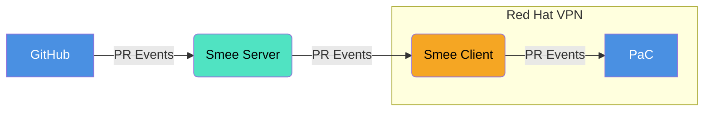
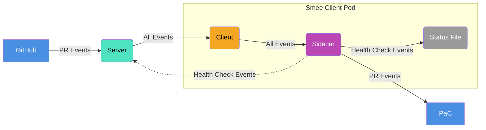
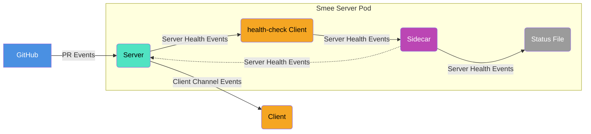

# smee-sidecar

A sidecar container for implementing health checks and monitoring for
[Smee](https://smee.io/) deployments. This sidecar provides active health checking
to verify end-to-end functionality between the Smee server and a client serving a
specific channel.

## Overview

The smee-sidecar acts as an instrumentation and proxy layer between Smee clients and
downstream services, providing:

- **End-to-end health checking** via round-trip webhook tests
- **File-based health monitoring** for Kubernetes probes
- **Prometheus metrics** for observability
- **Event relay** with monitoring capabilities

The sidecar periodically sends health check events to the Smee server, on the same
channel to which the Smee client subscribes. The Client forwards both regular and
health check events to the sidecar.

When the sidecar receives regular events, it proxies them to the downstream service
(e.g. Pipelines as Code). When it receives its own health check event, it correlate the
event back to the health check that generated that event and updates a status file,
shared between the client and the sidecar.

The sidecar also provide scripts for the sidecar and the client to be executed as
liveness probes and establish the containers' liveness. For example, if the client script
cannot confirm that successful health checks were processed recently, the client
container will restart, which should resolve issues in which the Smee client freezes and
stop forwarding events.





The same principal can be used in order to monitor Smee server health. A dedicated
health-checks client is deployed within the server pods, alongside the Smee Sidecar.
The health checks client listens on a dedicated health checks channel and forwards
to the sidecar health check events generated by the sidecar. The same mechanism of
shared status file and health check scripts is used to establish the liveness of all
containers within the server pod.



## Architecture

```
┌─────────────────────────────────────────────────────────┐
│                    Kubernetes Pod                       │
├────────────────────┬────────────────────────────────────┤
│   smee-client      │           smee-sidecar             │
│                    │                                    │
│                    │ ┌─────────────────┐                │
│ ┌─────────────────┐│ │ Relay Server    │                │
│ │                 ││ │ :8080           │                │
│ │   Webhook       ││ │                 │                │
│ │   Events        ││ └─────────────────┘                │
│ │                 ││ ┌─────────────────┐                │
│ └─────────────────┘│ │ Management      │                │
│                    │ │ Server :9100    │                │
│ Liveness: script   │ │                 │                │
│                    │ │ /metrics        │ ← Prometheus   │
│                    │ │ /debug/pprof/*  │ ← Debug (opt)  │
│                    │ └─────────────────┘                │
│                    │ ┌─────────────────┐                │
│                    │ │ Shared Volume   │                │
│                    │ │ /shared/        │                │
│                    │ │ - health scripts│                │
│                    │ │ - status file   │                │
│                    │ └─────────────────┘                │
└────────────────────┴────────────────────────────────────┘
                             │
                             ▼
                    ┌─────────────────┐
                    │  Downstream     │
                    │  Service        │
                    └─────────────────┘
```

Note that the same approach can also be used for actively verifying end to end
functionality for Smee server deployments.

For that, a server pod will contain a dedicated Smee client container for health checks
and a the smee-sidecar container alongside it, as above.

### How It Works

1. The Smee client is configured to forward events to the sidecar instead of the
   downstream service.
2. The sidecar inspects the events and forwards them to the downstream service, unless
   those are health check events.
3. The sidecar runs a background health checker that periodically:
    1. Sends an event to the same server and channel the client subscribes to.
    2. Waits for the event to be forwarded by the client.
    3. Writes the result (success/failure) to a shared file.
4. Both containers use file-based liveness probes that check the shared health status,
   avoiding HTTP dependencies and providing better failure isolation.

### Metrics

The sidecar exposes Prometheus metrics on `:9100/metrics`:

- `smee_events_relayed_total`: Counter of webhook events successfully relayed
- `health_check`: Gauge indicating the result of the last health check (1=healthy,
   0=unhealthy)

## Configuration

### Environment Variables

|Variable                        |Required|Default                    |Description                              |
|----------                      |--------|-------                    |-----------                              |
|`DOWNSTREAM_SERVICE_URL`        |✅      | -                         | Service to relay webhook events to      |
|`SMEE_CHANNEL_URL`              |✅      | -                         | Smee channel used by the client         |
|`HEALTH_CHECK_TIMEOUT_SECONDS`  |❌      |`20`                       | Timeout for end-to-end health checks    |
|`HEALTH_CHECK_INTERVAL_SECONDS` |❌      |`30`                       | Interval between background health checks|
|`SHARED_VOLUME_PATH`            |❌      |`/shared`                  | Path to shared volume for health files  |
|`HEALTH_FILE_PATH`              |❌      |`/shared/health-status.txt`| Path to health status file              |
|`INSECURE_SKIP_VERIFY`          |❌      |`false`                    | Skip TLS verification for health checks |
|`ENABLE_PPROF`                  |❌      |`false`                    | Enable pprof endpoints for debugging    |

### Example Configuration

```yaml
env:
  - name: DOWNSTREAM_SERVICE_URL
    value: "http://my-service:8080"
  - name: SMEE_CHANNEL_URL
    value: "http://smee-server/myawesomechannel"
  - name: HEALTH_CHECK_INTERVAL_SECONDS
    value: "30"
  - name: HEALTH_CHECK_TIMEOUT_SECONDS
    value: "20"
```

### Debugging

When `ENABLE_PPROF=true` is set (disabled by default), the management server exposes
pprof endpoints on `:9100/debug/pprof/` for performance profiling and debugging.
This includes endpoints for goroutine, heap, CPU profiles, and more.

## Kubernetes Deployment

### Complete Example

```yaml
apiVersion: apps/v1
kind: Deployment
metadata:
  name: my-app-with-smee
spec:
  replicas: 1
  selector:
    matchLabels:
      app: my-app
  template:
    metadata:
      labels:
        app: my-app
    spec:
      volumes:
        - name: shared-health
          emptyDir: {}
      containers:
        # Main smee client container
        - name: smee-client
          image: ghcr.io/chmouel/gosmee:latest
          args:
            - client
            - "https://smee.io/myawesomechannel"
            - "http://localhost:8080"
          livenessProbe:
            exec:
              command: ["/bin/bash", "/shared/check-smee-health.sh"]
            initialDelaySeconds: 20
            periodSeconds: 10
          volumeMounts:
            - name: shared-health
              mountPath: /shared

        # Sidecar container
        - name: sidecar
          image: quay.io/konflux-ci/smee-sidecar:latest
          ports:
            - containerPort: 8080
              name: relay
            - containerPort: 9100
              name: management
          env:
            - name: DOWNSTREAM_SERVICE_URL
              value: "http://localhost:3000"  # Your app
            - name: SMEE_CHANNEL_URL
              value: "https://smee.io/myawesomechannel"
          livenessProbe:
            exec:
              command: ["/bin/bash", "/shared/check-sidecar-health.sh"]
            initialDelaySeconds: 15
            periodSeconds: 10
          volumeMounts:
            - name: shared-health
              mountPath: /shared

        # Your application container
        - name: my-app
          image: my-app:latest
          ports:
            - containerPort: 3000
```

### Failure Isolation

The file-based health checking approach provides better failure isolation compared to
HTTP-based probes:

1. **No cross-container HTTP dependencies**: Each container has its own liveness probe
   script that reads from the shared health status file.
2. **Independent failure modes**: The smee-client probe checks both file age and health
   status, while the sidecar probe only checks if the process is updating the file.
3. **Reduced restart cascades**: If health checks fail due to external issues (e.g.,
   upstream Smee server down), only the client restarts while the sidecar continues
   running and attempting health checks.

However, for **server deployments** where both a Smee server and test client need to be
monitored together, cascading restarts can still occur if both containers use health
checks that depend on end-to-end functionality. To mitigate this:

- Configure liveness probes on both server and client with `failureThreshold` ×
  `periodSeconds` longer than the cluster's maximum backoff penalty.
- This ensures both containers can stay up simultaneously long enough for health checks
  to recover when external dependencies become available again.

## Image Registry

https://quay.io/repository/konflux-ci/smee-sidecar

## Development

### Building

```bash
# Build the container
docker build -t smee-sidecar:latest .
```

### Testing

```bash
# Run unit tests
go test ./...
```

## Known Limitations

* Only tested with [gosmee](https://github.com/chmouel/gosmee).
